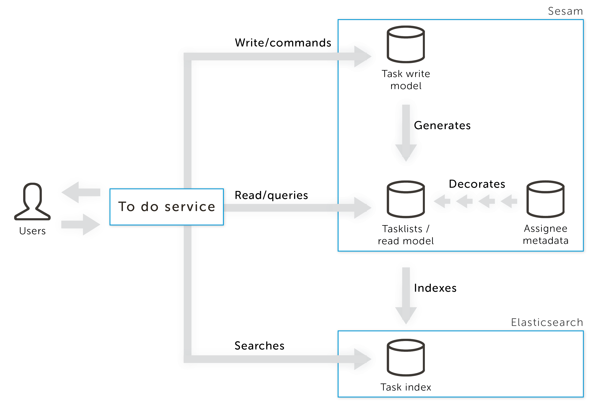
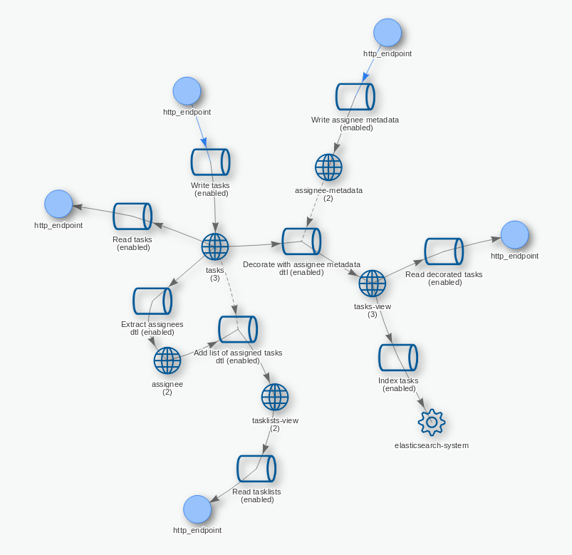

==================
sesam-cqrs-example
==================

How Sesam can change the architecture of your application
=========================================================

When you develop larger applications denormalized data can be the source of many bugs. CQRS addresses this by splitting your data into a normalized
write model and a denormalized read model. Deriving the read model from the write model can be a complex task. In this example we will show you how you
can implement a CQRS application using Sesam and Elasticsearch.

Why multiple data models?
=========================

When your application grows your domain model will often contain a lot of query code and code for denormalizing data for easier presentation logic.
These are separate concerns, and mixing them together often leads to poor `Domain Driven Design <https://en.wikipedia.org/wiki/Domain-driven_design>`_.
In Domain Driven Design you want to have domain experts designing the domain model and to keep that code as refactorable as possible. This allows you
to adopt new business requirements more quickly.

One way to keep your domain model clean is to use a pattern called `CQRS <http://martinfowler.com/bliki/CQRS.html>`_. This pattern decouples the model
into a write model and a read model. The write model is the domain model and this should be normalized to avoid unneccessary complexity and data duplication.
You then create separate read/query models that are updated based on events emitted when the write model changes.

Continous transformation of one data structure into another data structure is what Sesam does. So you just write your domain logic with a normalized data model, and
you configure Sesam how to transform this data model into a denormalized duplicate data structure.

You can also have multiple read/query models for various purposes. You might want to index parts of your model in a search engine. Sesam has builtin support for indexing
data to both Solr and Elasticsearch, and you can create your own micro services to adapt other data sinks as well.

Maybe you want the data of your application to partially conform to a schema, but still be extensible. For instance you want to have customers with name and addresses, but also
be able to contain any other data as well. In this scenario you might want to store the customers in a document database. Sesam is a document database, but you might also store them
in other document databases such as CouchDB or MongoDB. Maybe it would be nice to be able to write SQL queries for the parts of the data that actually has a schema. Sesam can
be configured to solve this by transforming the data in the document database into a sql database.

If different parts of your application has different needs for storing data, you might have adopted `polyglot persistence <http://martinfowler.com/bliki/PolyglotPersistence.html>`_.
In this case you have multiple write models that you might want to combine into various read models. For instance you might want to store a graph in your application
in `graph database <https://en.wikipedia.org/wiki/Graph_database>`_, but your accounting information in a immutable log database. You might then want a read model that contains data from both of these sources as well.
Sesam has builtin support for reading RDF (graph structure), and you can write adapters for other graph databases. Sesam can then combine the multiple data models into
one read model that you can use for querying the combined data structure.

You can also think of this example as a `realtime reporting database <http://martinfowler.com/bliki/ReportingDatabase.html>`_.

The "TODO" API example
======================

This example uses `Sesam <https://www.sesam.io/>`_ and `Elasticsearch <https://www.elastic.co/products/elasticsearch>`_ to implement a
`CQRS <https://msdn.microsoft.com/en-us/library/dn568103.aspx>`_ application. The example consists of the following parts:

- ``todo-service.py``: A stateless service that provides an API to update, retrieve and search for tasks. Stores and retrieves data using Sesam and provides search through Elasticsearch.
- *The command (write) model*: A simple model in Sesam that consist of only the ``tasks`` pipe and dataset.
- *The query (read) model*: A more complex model in Sesam that derives assignees from the tasks, merges in meta data about assignees and provides useful views over the tasks.
- *The search engine (also part of the query model)*: Tasks indexed using Sesam and Elasticsearch.

    A high level view of the example application.

Before you can start the application you will need to setup Sesam to run on ``http://localhost:9042``. Before you can upload the configuration defined in
``sesam.conf.json`` you will have to replace ``YOUR-IP-HERE``. See the `Getting started guide <https://docs.sesam.io/overview.html#edit-the-configuration-files>`_
for more information.

::

  ## upload sesam config
  $ sesam import sesam.conf.json
  ## post some metadata about assignees that we can use in the query model
  $ curl -XPOST localhost:9042/api/receivers/assignee-metadata/entities -d @samples/assignees-metadata.json -H "Content-Type: application/json"

    The flow of data for this Sesam configuration (screenshot from Sesam Management Studio)

If you also want to play with Elasticsearch you will need to setup Elasticsearch to run on ``http://localhost:9200``.

::

    ## spin up elasticsearch with docker
    $ docker run -p 9200:9200 -p 9300:9300 -d elasticsearch
    ## create the elasticsearch index that we will use to index the tasks
    $ curl -XPUT 'localhost:9200/todo?pretty'
    {
      "acknowledged" : true
    }

You can now build and run ``todo-service.py`` with Docker:

::

    ## build the image
    $ docker build -t todo-service .
    ## start the container
    $ docker run -p 5000:5000 --net host todo-service
     * Running on http://0.0.0.0:5000/ (Press CTRL+C to quit)

Note: You can also run the service outside Docker if you have a Python 3 environment using ``$ python3 app/todo-service.py``

The "todo" service listens on port 5000.

The scenario is a simple "todo" application. You can create tasks, assign tasks, get a list of tasks by assignee, and get a list of tasks where we decorate the assignee with additional metadata.
The tasks are assigned using the ``assigned_to`` attribute. The tasks can be of any shape you want, the application only cares about the ``assigned_to`` attribute.

Example interaction with the application:

::

    ## lets add a couple of tasks with assignees
    $ curl -XPUT 'http://localhost:5000/task/1' -H "Content-type: application/json" -d @samples/task1-baard.json
    $ curl -XPUT 'http://localhost:5000/task/2' -H "Content-type: application/json" -d @samples/task2-baard.json
    $ curl -XPUT 'http://localhost:5000/task/3' -H "Content-type: application/json" -d @samples/task3-gramoore.json
    ## we can look at a task
    $ curl 'http://localhost:5000/task/1'
    {
      "_deleted": false,
      "_hash": "45c45bf3a6fe5da40e91514bb49d71e0",
      "_id": "1",
      "_previous": null,
      "_ts": 1476046313077754,
      "_updated": 0,
      "assigned_to": "baard",
      "description": "Build Lego"
    }
    ## lets look at all the tasks assigned to baard
    $ curl 'http://localhost:5000/tasklist/baard'
    {
      "_deleted": false,
      "_hash": "4971dca08795f77c47829dfe411cac08",
      "_id": "baard",
      "_previous": null,
      "_ts": 1476046880466864,
      "_updated": 0,
      "tasks": [
        {
          "_deleted": false,
          "_hash": "45c45bf3a6fe5da40e91514bb49d71e0",
          "_id": "1",
          "_previous": null,
          "_ts": 1476046313077754,
          "_updated": 0,
          "assigned_to": "baard",
          "description": "Build Lego"
        },
        {
          "_deleted": false,
          "_hash": "4ab778a28ac71453a6d5e08f48771776",
          "_id": "2",
          "_previous": null,
          "_ts": 1476046317563169,
          "_updated": 1,
          "assigned_to": "baard",
          "description": "Write blog article on Sesam and CQRS"
        }
      ]
    }
    ## lets look at all the tasks and see the actual names of the assignees
    $ curl 'http://localhost:5000/task'
    [
      {
        "_deleted": false,
        "_hash": "032fe3c41a8ece0ae6c6c93930163fc8",
        "_id": "1",
        "_previous": 0,
        "_ts": 1476047578303715,
        "_updated": 3,
        "assigned_to": "baard",
        "assignee_metadata": {
          "_deleted": false,
          "_hash": "2ab12a959107082edbf4773f128d8c00",
          "_id": "baard",
          "_previous": null,
          "_ts": 1476046291372204,
          "_updated": 0,
          "name": "Baard Johansen"
        },
        "description": "Build Lego"
      },
      {
        "_deleted": false,
        "_hash": "1836145f8984cd49238a8d9c1d085e50",
        "_id": "2",
        "_previous": 1,
        "_ts": 1476047578303839,
        "_updated": 4,
        "assigned_to": "baard",
        "assignee_metadata": {
          "_deleted": false,
          "_hash": "2ab12a959107082edbf4773f128d8c00",
          "_id": "baard",
          "_previous": null,
          "_ts": 1476046291372204,
          "_updated": 0,
          "name": "Baard Johansen"
        },
        "description": "Write blog article on Sesam and CQRS"
      },
      {
        "_deleted": false,
        "_hash": "d2884584370622952d46ff3d375820b3",
        "_id": "3",
        "_previous": 2,
        "_ts": 1476047578303940,
        "_updated": 5,
        "assigned_to": "gramoore",
        "assignee_metadata": {
          "_deleted": false,
          "_hash": "a11aa0556878a1ef3654179035979afd",
          "_id": "gramoore",
          "_previous": null,
          "_ts": 1476046291372373,
          "_updated": 1,
          "name": "Graham Moore"
        },
        "description": "Implement micro services in Sesam"
      }
    ]
    ## lets see if we can find all tasks that contains Lego
    $ curl 'http://localhost:5000/search/lego'
    {
      "_shards": {
        "failed": 0,
        "successful": 15,
        "total": 15
      },
      "hits": {
        "hits": [
          {
            "_id": "1",
            "_index": "todo",
            "_score": 0.095891505,
            "_source": {
              "assigned_to": "baard",
              "assignee_metadata": {
                "_deleted": false,
                "_hash": "2ab12a959107082edbf4773f128d8c00",
                "_id": "baard",
                "_previous": null,
                "_ts": 1476046291372204,
                "_updated": 0,
                "name": "Baard Johansen"
              },
              "description": "Build Lego"
            },
            "_type": "task"
          }
        ],
        "max_score": 0.095891505,
        "total": 1
      },
      "timed_out": false,
      "took": 8
    }
    ## lets finish (delete) the Lego task
    $ curl -XDELETE 'http://localhost:5000/task/1'
    {
      "_deleted": true,
      "_hash": "45c45bf3a6fe5da40e91514bb49d71e0",
      "_id": "1",
      "_previous": null,
      "_ts": 1476046313077754,
      "_updated": 0,
      "assigned_to": "baard",
      "description": "Build Lego"
    }
    ## and see that it is now gone from the search index, the tasklist and the list of tasks
    $ curl 'http://localhost:5000/search/lego'
    {
      "_shards": {
        "failed": 0,
        "successful": 15,
        "total": 15
      },
      "hits": {
        "hits": [],
        "max_score": null,
        "total": 0
      },
      "timed_out": false,
      "took": 6
    }
    $ curl 'http://localhost:5000/tasklist/baard'
    {
      "_deleted": false,
      "_hash": "a168cb34dcc3c2bc971aa2a81bd9a7b5",
      "_id": "baard",
      "_previous": 0,
      "_ts": 1476050335179952,
      "_updated": 4,
      "tasks": [
        {
          "_deleted": false,
          "_hash": "4ab778a28ac71453a6d5e08f48771776",
          "_id": "2",
          "_previous": null,
          "_ts": 1476046317563169,
          "_updated": 1,
          "assigned_to": "baard",
          "description": "Write blog article on Sesam and CQRS"
        }
      ]
    }
    $ curl 'http://localhost:5000/task'
    [
      {
        "_deleted": false,
        "_hash": "1836145f8984cd49238a8d9c1d085e50",
        "_id": "2",
        "_previous": 1,
        "_ts": 1476047578303839,
        "_updated": 4,
        "assigned_to": "baard",
        "assignee_metadata": {
          "_deleted": false,
          "_hash": "2ab12a959107082edbf4773f128d8c00",
          "_id": "baard",
          "_previous": null,
          "_ts": 1476046291372204,
          "_updated": 0,
          "name": "Baard Johansen"
        },
        "description": "Write blog article on Sesam and CQRS"
      },
      {
        "_deleted": false,
        "_hash": "d2884584370622952d46ff3d375820b3",
        "_id": "3",
        "_previous": 6,
        "_ts": 1476050304824843,
        "_updated": 7,
        "assigned_to": "gramoore",
        "assignee_metadata": {
          "_deleted": false,
          "_hash": "a11aa0556878a1ef3654179035979afd",
          "_id": "gramoore",
          "_previous": null,
          "_ts": 1476046291372373,
          "_updated": 1,
          "name": "Graham Moore"
        },
        "description": "Implement micro services in Sesam"
      }
    ]

Note the example uses `curl <https://curl.haxx.se/>`_ to send the request and `jq <https://stedolan.github.io/jq/>`_ prettify the response.
